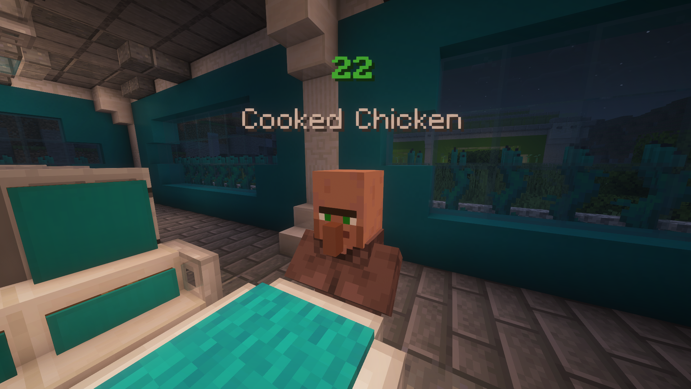
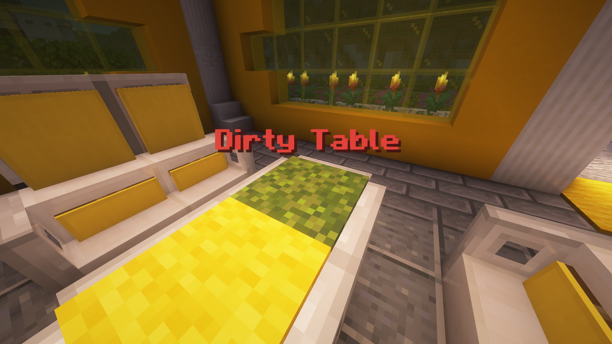
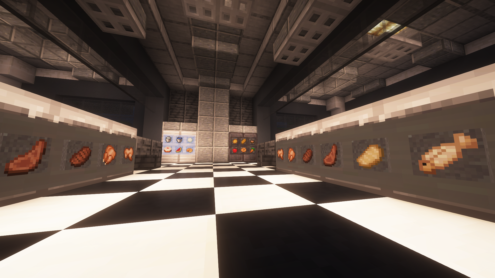
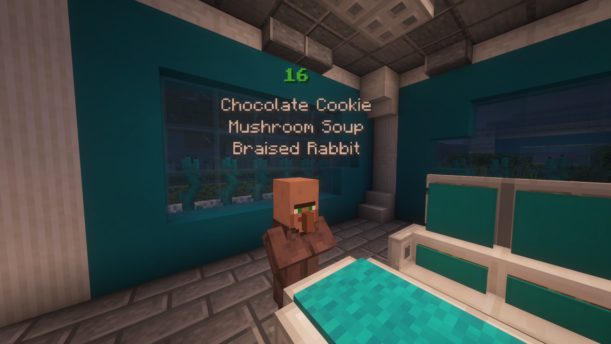

# Restaurant Rush

Restaurant Rush is a fast-paced Minecraft mini-game where you serve villagers, clean tables, and race against time.

## Important

- Tested on Minecraft Java Edition `1.21.8` (should also work on `1.21.7`)
- Multiplayer compatible to up to 8 players
- If anything isn’t working properly, use the command `/reload`
- No mods required, vanilla-compatible

## Installation

- Go to the Releases page of this project
- Download `WorldDownload_v1.0.0.zip` (ignore the auto-generated “Source code” files)
- Right-click the file → Extract All…
- Copy the extracted folder into your Minecraft saves folder
  - Win + R → type `%appdata%/.minecraft/saves`
- Start Minecraft and the world should appear in your Singleplayer menu

## Game Principle

In Restaurant Rush, villagers enter your restaurant and place food orders. Your task is to deliver the correct dishes as quickly as possible. The faster you serve your customers, the better your score.

After guests finish eating, you also need to clean the tables — otherwise no new villagers will come in. Managing both speed and cleanliness is key to achieving a high score.

Food ingredients can be collected from different stations: the oven, the pantry, and the fridge. Knowing where to find each item is essential to serving customers quickly.

As time goes on, more and more villagers with more complex orders will enter the restaurant, making the game increasingly challenging. You’ll need to stay organized and work under pressure to keep everyone happy and maximize your score.

## Disclaimer

This project is an unofficial recreation of the former Hive minigame Restaurant Rush.
All rights to the original game, name, concept, and assets belong to Hive Games Ltd.
This project is not affiliated with Hive Games.

The design of the cars and the kebab store in the lobby are also not mine.
